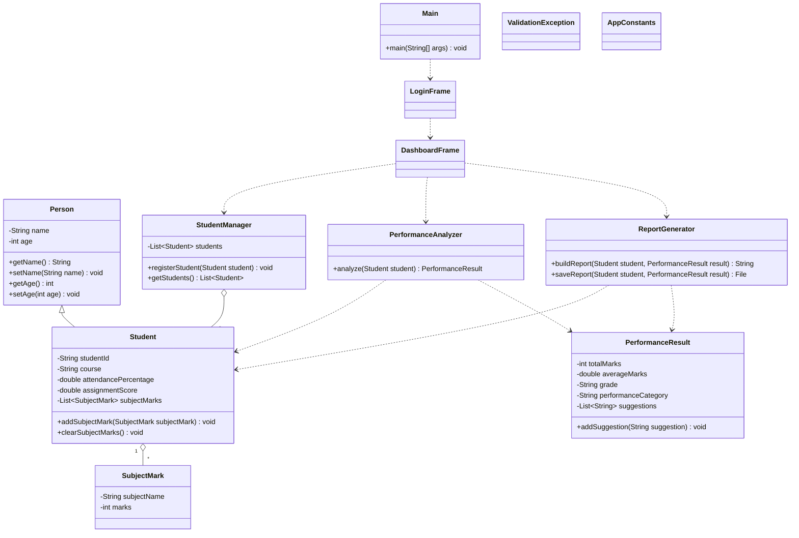

# UML Class Diagram

## Main Relationships

- `Student` inherits common fields from `Person`.
- `Student` contains multiple `SubjectMark` objects using an `ArrayList`.
- `PerformanceAnalyzer` calculates total, average, grade, performance category, and suggestions.
- `ReportGenerator` creates and saves a text report using file handling.
- `DashboardFrame` connects the GUI with student management, analysis, and report generation.
